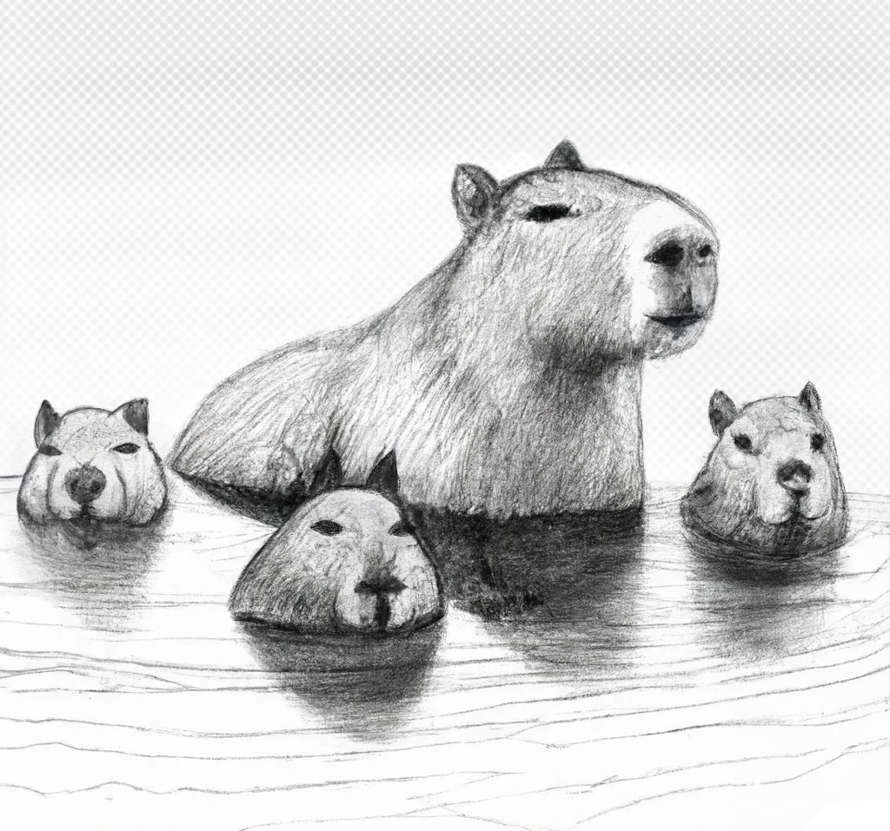

1
{: .align-center}
2
![CapybaraFamily
3
!Capybara Family{: .align-center }
4
{: .align-center}

The First Generation of the Capybara Family.

 

_This website is dedicated to the current and future members of the Capybara family. Weird Kitty and her friends have created this toolkit, which includes some useful links and notes. We hope you can enjoy more neutrino therapy than spending countless hours staring at a computer screen, trying to decide what to do next._

 
 
 

_Note: Most of the images used in this website are created by both humans and AI. This website is also created with extensive help from AI._
