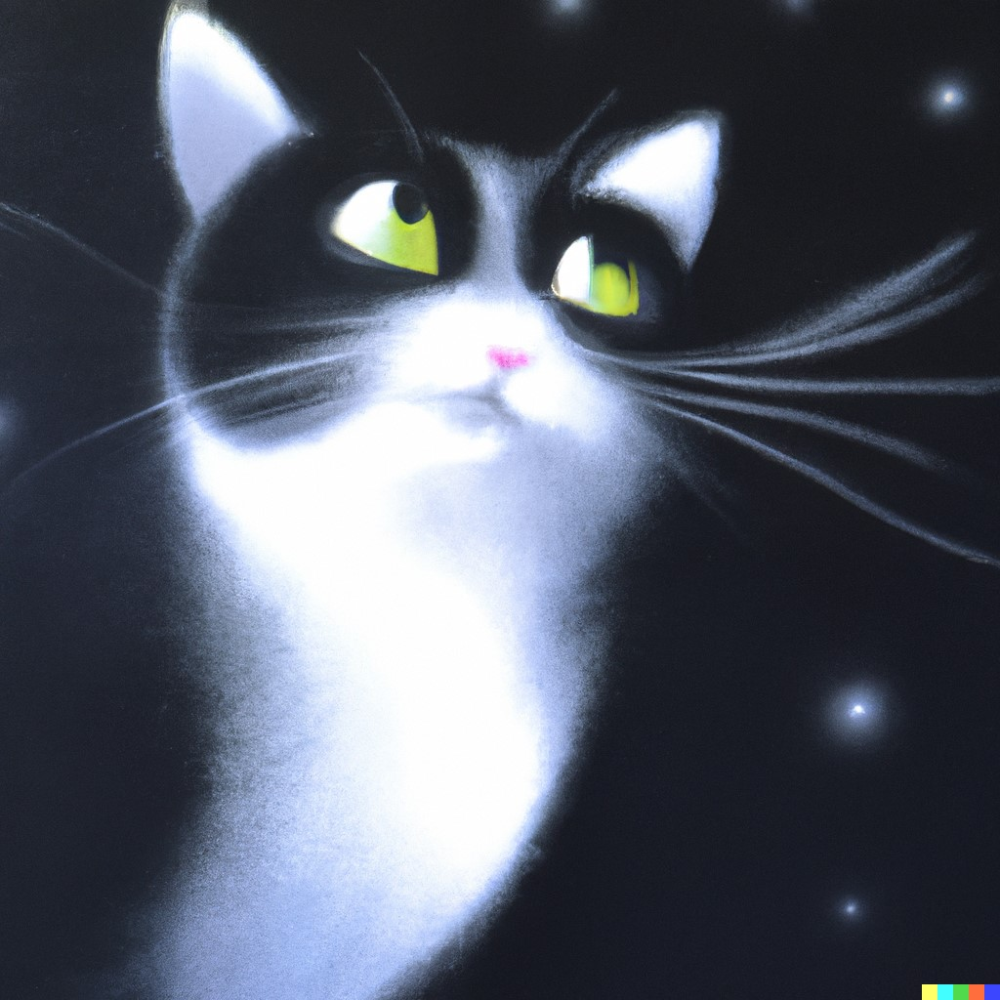
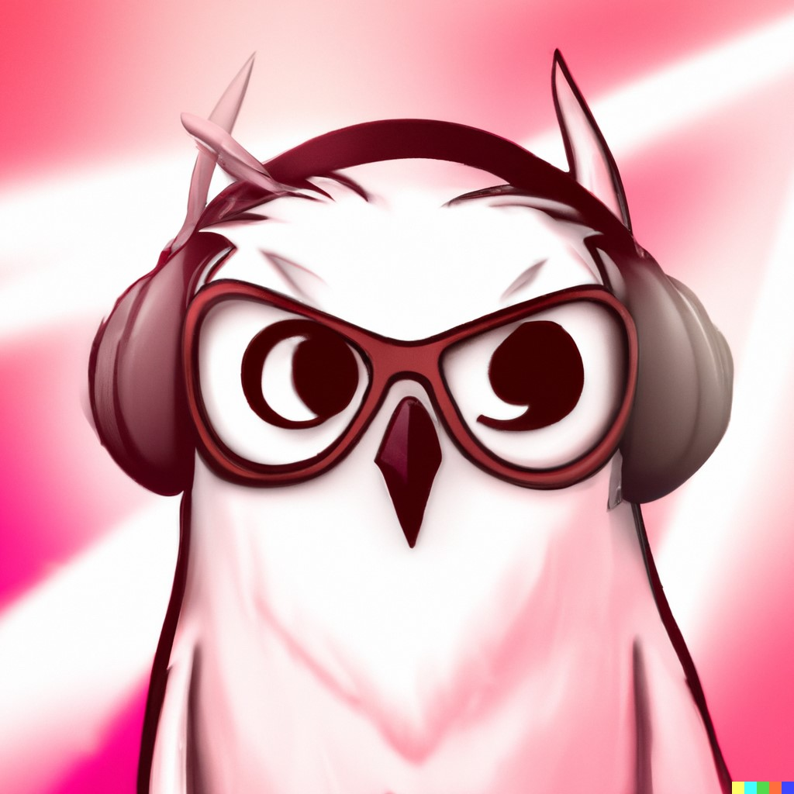
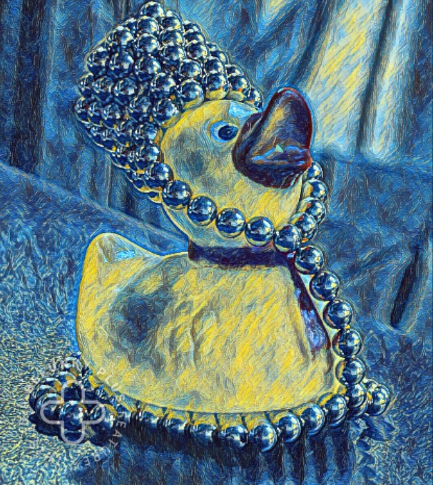
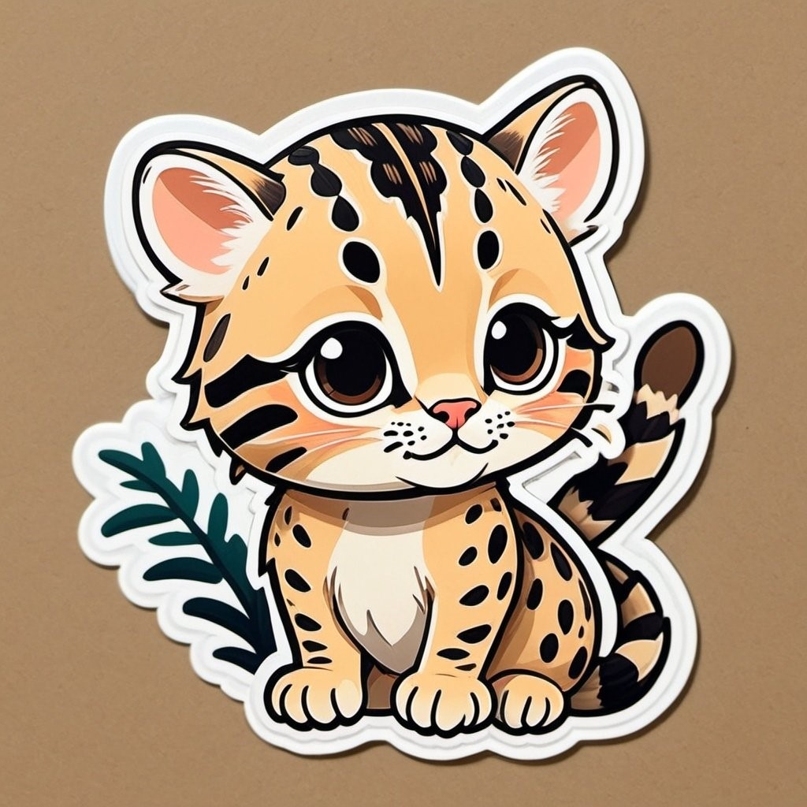
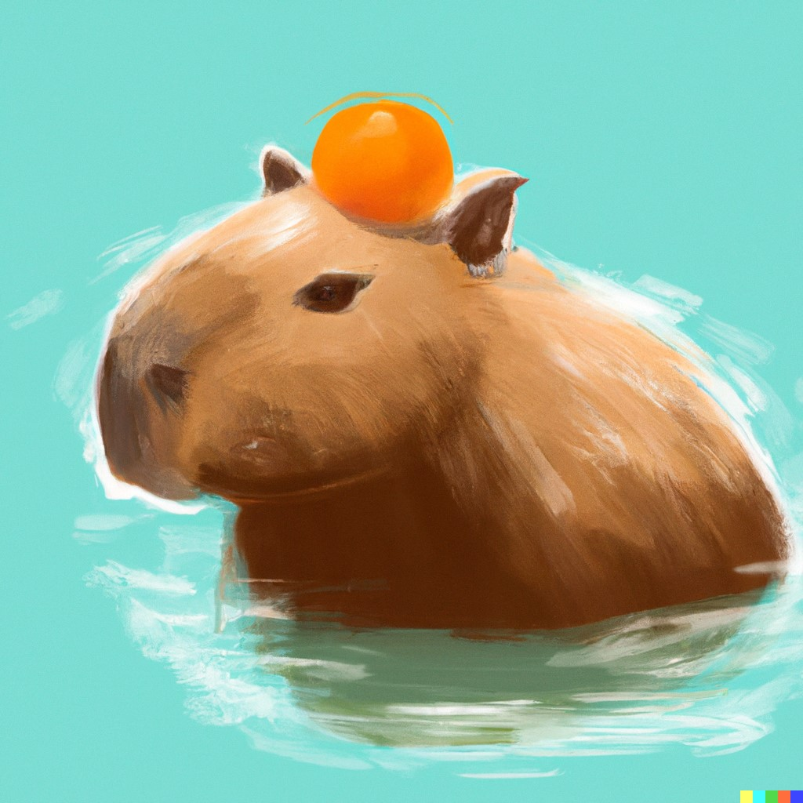

## The Weird Kitty  _(cryZ)_
So, this kitty can do some physics...doesn't want to write...and She wants to have the viscacha lifestyle:

<p align="center"> <em>Finding moments of peacefulness in the cruel nature.</em> </p>

So, she really wants to:
```sh
do goHome.mac
```
{: .align-center}

## The Chatty Owl  _(monoY)_
This is Weird Kitty's friend, she is Chatty Owl, and she can do some physics too... She is very strong... 

> I can take down everyone in this group.
> 
> ---The Chatty Owl

She can run... and she runs **a lot**... When Weird Kitty sees her run, she wants to say:
>Run Melos! Run!
>
>---Osamu Dazai

{: .align-center}

## The Hyperational Ducky   _(davesX)_
This is also Weird Kitty's friend, he does some physics and coding... and if you let this Hyperrational Ducky decide where to go for group lunch, we'd all starve to death...
> "We were doing an experiment..."
> 
> ---By The Hyperrational Ducky, At the Border.


Also check out his useful <a href="https://github.com/Dobrowod?tab=repositories">code</a>.

{: .align-center}

## The Stalkerish Ocelot
The new character, she is good at searching stuff... like actual useful stuff. 
{: .align-center}

## The Peaceful Capybara

<p align="center"><b>The boss.</b></p>


{: .align-center}
